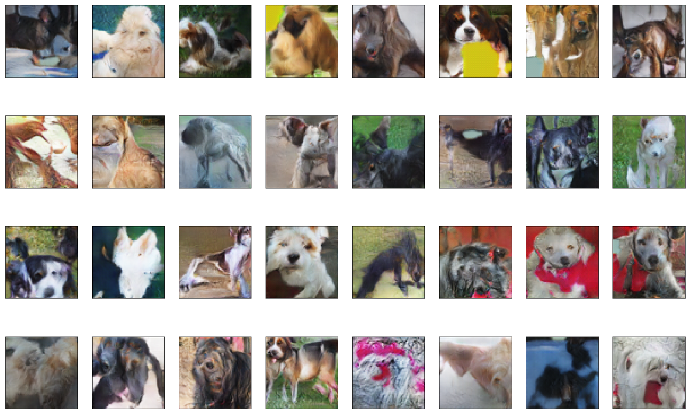

# The bronze solution of the Kaggle Generative Dog Images Challenge 2019
This is the solution of the first Kaggle GAN competitions 

The output dogs are pretty, but there are lots of artifacts caused by the relatively short traning procedure (9 hours). 

